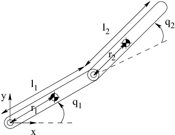

# PreTask
** (This task is not be submitted this is just for the practise)

Before moving on with the tasks, try building a basic “2R planar robotic arm” using URDF, consisting of two revolute joints(represented by the two circles) and two links(l1 and l2).

---
#Task-2.1

# Task-1

## Build and Visualize a Simple Quadrotor (URDF)

This task challenges you to build a basic visual representation of a quadrotor drone using the Unified Robot Description Format (URDF).

### What you’ll do:
* **Design with URDF:** Using a text editor, create a URDF file for a virtual drone.
* **Focus on Visuals:** Define the drone's components (fuselage, arms, propellers) using `<visual>` and `<geometry>` tags with simple shapes (boxes for the body, cylinders for the motors/props).
* **Simulation:**
    1.  Access the provided [online URDF visualizer](https://gkjohnson.github.io/urdf-loaders/javascript/example/bundle/).
    2.  Upload your completed URDF file to the visualizer.
    3.  Utilize the visualizer's functionalities to verify the placement of your rotors.
    4.  Animate the `continuous` joints to observe and record the propellers spinning.

### Deliverables:
1.  **URDF File:** A complete URDF file in the designated folder, defining the drone's visual components with simple shapes and relevant tags.
2.  **Video Recording:** Record a short video demonstrating both:
    * The visual representation of the drone loaded in the online URDF visualizer.
    * Basic rotation of the propellers using the visualizer's animation features.

    *All this put in Github and send the Link of the Repo*

[Submit here!](#)

---