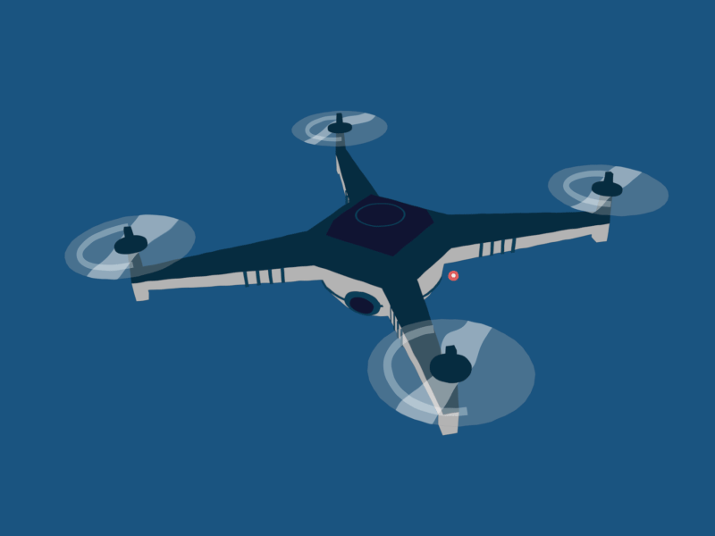

# Task 2
## Altitude of a QuadRotor

The mass of the quadrotor introduces a **steady state error** while trying to gain a certain altitude. Pure **PD control** becomes useless here as it cannot counter this steady state error (caused by the constant force of gravity).

To counter the steady state error, we introduce an **Integral** error term into the equation, resulting in a **PID controller**.

This problem aims to experimentally show you the importance of the Integral term for removing the steady state error.

### 🎥 Reference Resource
To build intuition for this task, watch this video:
* [Intuitive way to learn PID control](https://www.youtube.com/watch?v=wkfEZmsQqiA)
* [Also try this](https://www.youtube.com/watch?v=4Y7zG48uHRo)

The video explains the steady state error and why it can occur in the case of a drone. Try to focus on *why* the Integral gain is necessary to counter it.

### 🎮 The Simulation
A PID controller has been implemented to adjust the altitude of the drone. You can adjust the PID gains through the **track-bars** which will appear when you run the code.

#### Challenges for Task 2.3
1.  **Experiment** with the PID gains and observe what effect they have on the drone's motion. Can you relate them to what you have learned so far?
2.  **Find the ideal PID gains** such that the drone reaches the height of **3 meters** without much fluctuation and as fast/stably as possible for 10 sec.
3.  **Observe** why it is almost impossible to control the drone perfectly *without* using the additional integrating term.

> **Note:** The code is not necessary to go through line-by-line, but understanding it will benefit you during Task 3 and future weeks. The code has been well-commented for this purpose.

### 📋 Instructions
1.  **Download** the provided folder, along with the python code and src.
2.  **Execute** the python code.
3.  **Press ENTER** after selecting the simulation window to start the simulation.
4.  **Press ENTER** again to reset it and run it again.

### Submission 
1. .py file of the code **with the values of P I D mentioned at the top.**
2. **video** of the drone along with the terminal showing its height.

**Put all this in Github and Submit the link of the Repo**
[Submission Link](https://docs.google.com/forms/d/1XdrWg5ZymrubJwWvwuUfUCARNPzmK7JQNkCludnv89o/viewform)
---

## 🎲 Game Time

**Welcome back to the party!!!**

We are here with another round of **Did you get the control?**

Here you'll be asked a few interesting questions based on the task you just did. The goal here is not to win, but to build an intuition about the concepts and learn new things.

> **Note:** This is evaluative and is also meant for strengthening your knowledge.

Here is the link to Part 2. All the Best!
* [Did You Get The Control? - Part 2](https://docs.google.com/forms/d/1l66HURuEpovKzYJL_hhBou43UgvUPA9FXiwh0Md6CQs/viewform)