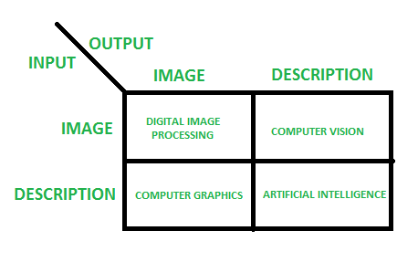
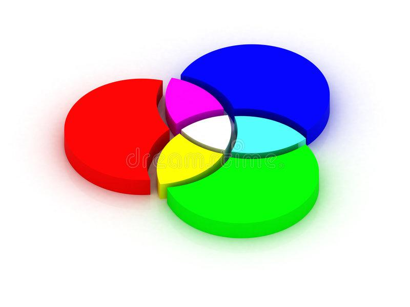
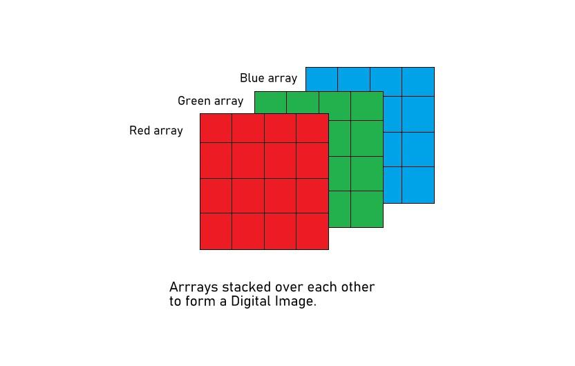

# Image Processing Basics

Digital Image Processing means processing digital images using a digital computer.  
It involves the use of computer algorithms to:

- Enhance images  
- Extract useful information  
- Automate image-based tasks  

It uses algorithms and mathematical models to process and analyze digital images.  
The main goals are to:

- Enhance image quality  
- Extract meaningful information  
- Automate image-based or vision-based tasks  

---

## Basic Steps in Digital Image Processing

1. **Image Acquisition**  
   Capturing an image using a digital camera or scanner, or importing an existing image into a computer.

2. **Image Enhancement**  
   Improving visual quality by increasing contrast, reducing noise, and removing artifacts.

3. **Image Restoration**  
   Removing degradations such as blurring, noise, and distortion using mathematical models.

4. **Image Segmentation**  
   Dividing an image into regions or segments corresponding to specific objects or features.

5. **Image Representation and Description**  
   Representing an image in a way that can be analyzed and manipulated, and describing its features in a compact form.

6. **Image Analysis**  
   Using algorithms to extract information, recognize objects, detect patterns, and quantify features.

7. **Image Synthesis and Compression**  
   Generating new images or compressing existing ones to reduce storage and transmission needs.

**Applications** include medical imaging, remote sensing, computer vision, and multimedia.

---

## Image Processing Steps (High-Level Workflow)

1. **Importing the Image**  
   Using image acquisition tools (camera, scanner, file input) to bring the image into the system.

2. **Analyzing and Manipulating the Image**  
   Applying various techniques (filtering, enhancement, segmentation, etc.) to modify or extract information.

3. **Output**  
   The result can be:
   - An altered image, or  
   - A report/measurements based on the analysis.

---

## What Is an Image?

An image can be defined as a two-dimensional function:

\[
F(x, y)
\]

where:
- \(x\) and \(y\) are spatial coordinates  
- The amplitude of \(F\) at \((x, y)\) is called the **intensity** at that point  

When \(x\), \(y\), and intensity values are **finite and discrete**, the image is called a **digital image**.

- A digital image can be defined by a **2D array** arranged in rows and columns.
- A digital image consists of finite elements, each with a value at a specific location.
- These elements are called:
  - Picture elements  
  - Image elements  
  - **Pixels** (most commonly used term)

---

## Types of Images

1. **Binary Image**
   - Contains only two pixel values: 0 and 1  
   - 0 represents black, 1 represents white  
   - Also known as **monochrome** (in the context of black & white).

2. **Black and White Image**
   - Consists solely of black and white colors (no gray shades).

3. **8-bit Color Format (Grayscale Image)**
   - Has 256 shades of gray  
   - Pixel values range from 0 to 255  
     - 0 → black  
     - 255 → white  
     - 127 → mid-gray  

4. **16-bit Color Format (High Color Format)**
   - Includes 65,536 colors  
   - Often divided into **Red**, **Green**, and **Blue** components (RGB format).

---

## Image as a Matrix

Images are represented as matrices:

- Each pixel corresponds to a matrix element at row \(i\), column \(j\).
- For a grayscale image:  
  - The image is an \(M \times N\) matrix.
- For a color RGB image:
  - It is an \(M \times N \times 3\) array.

Every element of this matrix is called:
- An image element  
- A picture element  
- A **pixel**

---

## Phases of Image Processing

1. **Acquisition**
   - Includes tasks such as scaling and color conversion (e.g., RGB → Gray).

2. **Image Enhancement**
   - Used to extract hidden details and improve image appeal.  
   - It is somewhat **subjective** (depends on application and viewer).

3. **Image Restoration**
   - Improves image quality based on **mathematical** or **probabilistic** models of degradation.

4. **Color Image Processing**
   - Handles **pseudocolor** and **full-color** image processing using color models.

5. **Wavelets and Multi-Resolution Processing**
   - Represents images at various degrees of resolution.

6. **Image Compression**
   - Focuses on reducing the size or resolution of images to save storage and transmission bandwidth.

7. **Morphological Processing**
   - Extracts components useful in shape representation and description (e.g., using dilation, erosion).

8. **Segmentation Procedure**
   - Partitions an image into parts or objects.  
   - **Autonomous segmentation** is particularly challenging.

9. **Representation and Description**
   - Choosing a representation (boundary, region-based, etc.)  
   - Transforming raw data into processed data suitable for analysis.

10. **Object Detection and Recognition**
    - Assigns labels to objects based on their descriptors/features.

---

## Overlapping Fields with Image Processing

- **Digital Image Processing**
  - Input: Image  
  - Output: Image  

- **Computer Vision**
  - Input: Image  
  - Output: Information/description (e.g., detected object labels, measurements)

- **Computer Graphics**
  - Input: Description or code  
  - Output: Image  

- **Artificial Intelligence (AI)**
  - Input: Description, keywords, or code  
  - Output: Description, labels, decisions, or keywords  

---

## What Is a Pixel?

A **pixel** (short for *picture element*) is:

- The smallest unit of a digital image or display that can be controlled or manipulated.
- A tiny square or rectangular element that contributes to the overall picture.
- Each pixel is defined by:
  - Its **coordinates** (position)
  - Information about **color**
  - **Brightness** (intensity)
  - Sometimes **opacity** (alpha)

Understanding pixels is crucial because they determine the **resolution** and **quality** of an image.

**Example:**

- A resolution of **1920 × 1080** (Full HD) means:
  - 1920 pixels horizontally  
  - 1080 pixels vertically  
  - Total pixels = \(1920 \times 1080\) ≈ 2 million pixels

---

## History of Pixels

- The word **“pixel”** is a combination of **“picture”** and **“element”**.
- It emerged as digital imaging began to develop.
- In the 1950s and 1960s:
  - Computer graphics and digital imaging technologies were in their early stages.
  - Researchers needed a way to convert visual information into digital form.
  - This led to the concept of **pixels** as the fundamental elements of a digital image, each defined by color and brightness.

---

## Defining Key Terminologies

### 1. Pixel (Picture Element)

- The smallest part of a computer picture.
- Represents one spot in the entire image.
- Each pixel contains information about:
  - Color
  - Brightness
  - Position
- When combined, pixels form complete pictures, text, and videos.

### 2. Resolution

- Refers to the number of pixels in a digital photo.
- Typically expressed as **width × height** (e.g., 1920 × 1080).
- Higher resolution → more detail.
- For print, it can also be measured in:
  - Pixels per inch (**PPI**)
  - Pixels per centimeter (**PPCM**)

### 3. Pixel Density

- Often expressed as **PPI** for screens.
- Higher pixel density → sharper and clearer images.
- Mobile phones with high pixel density have more detailed and colorful displays.

### 4. Color Depth (Bit Depth)

- Indicates how many **bits** are used to represent the color of each pixel.
- Common values: **8-bit**, **16-bit**, **24-bit**.
- More bits → more possible colors → richer, more detailed images.

### 5. Raster and Vector Graphics

- **Raster Graphics**
  - Composed of many small pixels.
  - Resolution-dependent (zooming in shows pixelation).
  - Common for photos (e.g., JPEG, PNG).

- **Vector Graphics**
  - Use mathematical equations to represent shapes (lines, curves).
  - Can be scaled without losing quality.
  - Ideal for logos, icons, and illustrations (e.g., SVG).

### 6. Aspect Ratio

- The ratio of an image’s width to its height.
- Common aspect ratios:
  - 4:3  
  - 16:9  
  - 1:1  
- Different devices and media require specific aspect ratios, affecting how images are displayed or captured.

---

## Color Spaces

### RGB Color Space

- RGB stands for **Red, Green, Blue**.
- An RGB image can be viewed as three separate grayscale images:
  - Red channel  
  - Green channel  
  - Blue channel  
- When combined and sent to the three inputs of a color display, they produce a full-color image.

**Key Points:**

- RGB blends Red, Green, and Blue to form a wide range of colors.
- Often called a **true color image** when using 24-bit (8 bits per channel), because it can represent:
  - \(256 \times 256 \times 256 = 16,777,216\) colors (~16 million).

**Advantages of the RGB Color Model:**

- No transformations required to display on most screens.
- Considered the **base color space** for many applications.
- Computationally practical and easy to implement.
- Uses its additive property for video displays.
- Commonly used in:
  - Displays  
  - Cameras  
  - Scanners  

#### RGB Composition

- An RGB image is an \(M \times N \times 3\) array of color pixels.
- Each pixel has three values: (R, G, B) at that location.

Example:

- Pixel A: **(255, 0, 255)**  
- Pixel B: **(127, 255, 0)**  

Each color plane is an \(M \times N\) matrix.

If the image is of class `uint8`:

- Each color component can take values from 0 to 255 (256 shades).
- Total color combinations:  
  \[
  256 \times 256 \times 256 = 16,777,216
  \]

#### Color Planes in MATLAB

Let the RGB image array be `I`:

- `I(:, :, 1)` → Red color plane  
- `I(:, :, 2)` → Green color plane  
- `I(:, :, 3)` → Blue color plane  

You need to place the image in MATLAB’s working directory or use the full path to load it.

---

### HSV Color Space

HSV stands for:

- **H**: Hue  
- **S**: Saturation  
- **V**: Value (brightness)  

HSV is considered a more accurate representation of how humans perceive color than RGB or CMYK.

You can imagine HSV as a **cone**:

- Hue: angle around the cone (type of color)  
- Saturation: distance from center (color intensity)  
- Value: vertical axis (brightness)

#### Hue (H)

- Represents the **color type**.
- Range: **0 to 360 degrees**.

| Angle (degrees) | Color    |
|-----------------|----------|
| 0 – 60          | Red      |
| 60 – 120        | Yellow   |
| 120 – 180       | Green    |
| 180 – 240       | Cyan     |
| 240 – 300       | Blue     |
| 300 – 360       | Magenta  |

#### Saturation (S)

- Represents how **pure** the color is.
- 100% saturation → pure color  
- 0% saturation → no color → grayscale (just brightness)

#### Value (V)

- Represents **brightness** of the color.
- 0 → total black  
- 100 → full brightness (depending on saturation)

#### Advantages of HSV

- Closely matches how humans think about color (hue, vividness, brightness).
- Separates **luma** (brightness) from color information.
- Allows operations like **histogram equalization** to be applied only on the intensity (V) channel.

**Common Uses:**

- Histogram equalization  
- Converting grayscale images to RGB color images  
- Visualization of images (varying H, S, V for different effects)

---

## More on OpenCV

To explore practical implementations:

- OpenCV Documentation  
- OpenCV C++ Tutorial  

(You can add direct links here in your GitHub README, for example to the official OpenCV docs and tutorials.)

---
