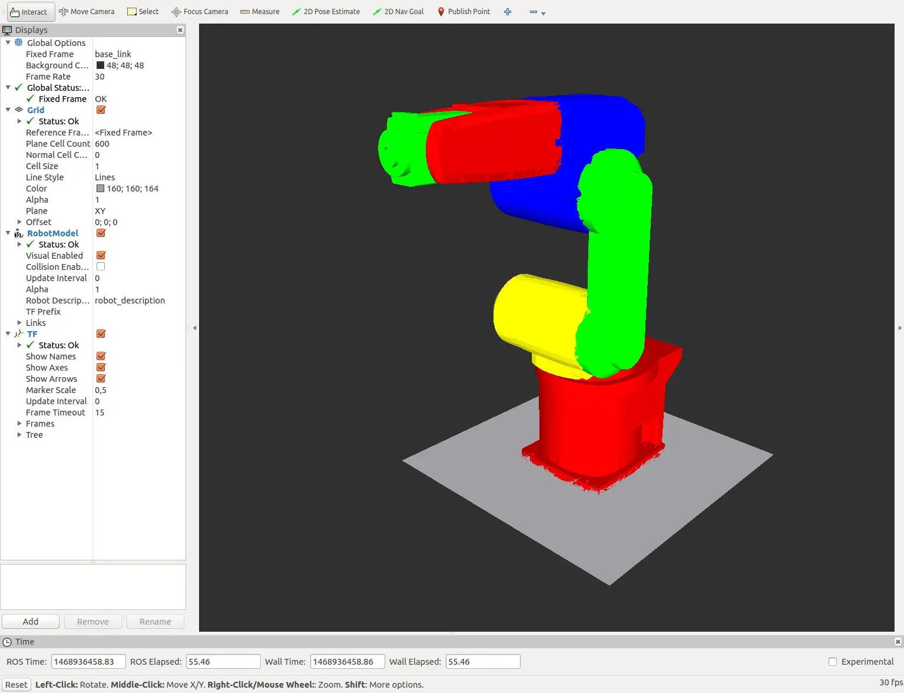

# 🛠️ URDF and Drone Design

We've explored the building blocks (fuselage & rotors) and their power source (BLDC motors). Now, meet **URDF**: your drone's digital blueprint!

URDF (Unified Robot Description Format) describes your drone's physical structure—its frame, rotor placement, mass, and inertia—in a way computers understand. Think of it as building a drone in a flight simulator; URDF lets software like Gazebo or ROS grasp the drone's aerodynamics and simulate stable flight.



Here's a step-by-step guide to get you started with creating your own URDF file for a drone:

### 1. XML Basics
URDF is based on XML. If you are new to it, here is a [quick video on basic XML syntax](https://www.youtube.com/results?search_query=xml+basics+for+ros).

### 2. URDF Introduction
Check out [this introductory lecture](http://wiki.ros.org/urdf/Tutorials) to get yourself acquainted with how URDF defines robot geometry.

### 3. Hands-on Practice
Now it's time to write your own drone URDF file! [These tutorials](http://wiki.ros.org/urdf/Tutorials/Building%20a%20Visual%20Robot%20Model) will guide you through the process.
* **Tip:** Don't worry about making it look like a sleek DJI drone yet. Focus on the structure: a simple box for the body and cylinders for motors.

### 4. Decoding the Code
The various tags and attributes might seem complex, especially regarding **inertial values** (crucial for stable flight). [These resources](http://wiki.ros.org/urdf/XML) offer detailed explanations.

### 5. Additional Resources
You may follow these [ROS wiki tutorials for URDF](http://wiki.ros.org/urdf/Tutorials) and check out [this video](https://www.youtube.com/results?search_query=ros+urdf+tutorial)!

---

### 🐛 Debugging Help
Creating URDF files can be tricky, and syntax errors are common. If your drone isn't spawning correctly, use the generic URDF tools. Enter the following in your terminal:

```bash
$ sudo apt-get install liburdfdom-tools
```
This will parse the file and tell you exactly which line has an error. If the file is parsed successfully, a summary of the parent (base_link) and child links (rotors) will be outputted.

***Remember: Creating a URDF file takes practice. Don't get discouraged if it takes some time to master!

Check your URDF file with the help of this [online visualizer](https://mymodelrobot.appspot.com/5629499534213120)

## Now Lets Move Towards First Task!!!